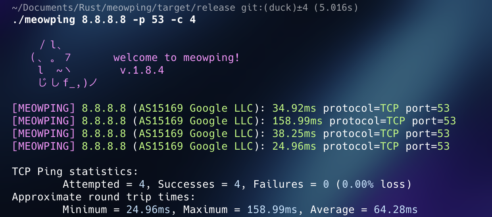

# MeowPing

MeowPing is a command-line utility for testing network connectivity using ICMP echo requests or TCP connections. It provides similar functionality to traditional ping utilities but with a touch of whimsy and color. MeowPing supports both domain names and IP addresses, allowing users to check the availability and responsiveness of network hosts. Don't forget to leave a ⭐ :D

## Features

- ICMP echo request-based network testing.
- TCP connection-based network testing.
- HTTP(S) request-based network testing.
- Colorful and visually appealing output, now for the response time as well.
- Display of connection statistics including success rate, minimum, maximum, and average connection times.
- Works with IPv4, IPv6 and Domains.

## Third-Party Services

**Disclaimer:** For TCP connections, MeowPing retrieves ASN/organization data from https://ipinfo.io. Use `-a`/`--no-asn` to disable these API calls and use static data instead.

## Usage

MeowPing offers a simple command-line interface with various options:

```powershell
meowping <destination> [OPTIONS]

ARGS:
    <destination>           Specify the destination(s) to ping (can be an IP address, domain name, or a comma-separated list or [list,of,hosts])

OPTIONS:
    -h, --help              Prints the Help Menu
    -p, --port <port>       Set the port number (default: ICMP, with: TCP)
    -s, --http              Check if the destination URL is online via HTTP/S
    -t, --timeout <ms>      Set the timeout for each connection attempt in milliseconds (default: 1000ms)
    -c, --count <count>     Set the number of connection attempts (default: 65535)
    -m, --minimal           Changes the Prints to be more Minimal
    -a, --no-asn            Disable ASN/organization lookups (use static data)
```


### Example Usage

```powershell
# Single host
./meowping 8.8.8.8 -p 53

# Multiple hosts (comma-separated)
./meowping 1.1.1.1,8.8.8.8,example.com -p 53

# Multiple hosts (bracketed)
./meowping [1.1.1.1,8.8.8.8,example.com] -p 53

# Subnet scan
./meowping 94.249.228.0/24 -p 22
```

**Disable ASN lookups for privacy:**
```powershell
./meowping 8.8.8.8 -p 53 -a
```

**For Linux users to get ICMP working.**

```powershell
sudo setcap cap_net_raw+ep ./meowping
```

**For macOS Users**
Run `meowping` with elevated privileges using `sudo` to enable ICMP functionality

```bash
sudo ./meowping
```

## Preview



## License
This project is MIT licensed. You're free to use, modify, and distribute it, but please provide attribution to the original author if you incorporate this code into your project. This supports open-source and recognizes contributors' work.
