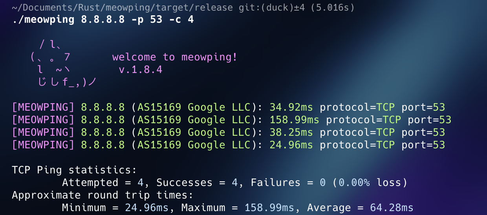

# MeowPing

> **Mirror (Read-only):** A read-only mirror of this repository is available at [codeberg.org/enty/meowping](https://codeberg.org/enty/meowping).

MeowPing is a command-line utility for testing network connectivity using ICMP echo requests or TCP connections. It provides similar functionality to traditional ping utilities but with a touch of whimsy and color. MeowPing supports both domain names and IP addresses, allowing users to check the availability and responsiveness of network hosts. Don't forget to leave a ⭐ :D

## Features

- ICMP echo request-based network testing.
- TCP connection-based network testing.
- UDP port probing (response = open, Port Unreachable = closed, silence = open|filtered).
- Multi-port probing of several ports (and ranges) in one run, across single hosts, multiple hosts, and subnets.
- HTTP(S) request-based network testing.
- Colorful and visually appealing output, now for the response time as well.
- Display of connection statistics including success rate, minimum, maximum, and average connection times.
- Works with IPv4, IPv6 and Domains.

## Third-Party Services

**Disclaimer:** For TCP and UDP connections, MeowPing retrieves ASN/organization data from https://ipinfo.io. Use `-a`/`--no-asn` to disable these API calls and use static data instead.

## Usage

MeowPing offers a simple command-line interface with various options:

```powershell
meowping <destination> [OPTIONS]

ARGS:
    <destination>           Specify the destination(s) to ping (can be an IP address, domain name, or a comma-separated list or [list,of,hosts])

OPTIONS:
    -h, --help              Prints the Help Menu
    -p, --port <port(s)>    Port to probe (default: ICMP). Accepts a single port, a comma list (53,80,443), or a range (20-25)
    -s, --http              Check if the destination URL is online via HTTP/S
    -u, --udp               Probe a UDP port instead of using TCP (requires -p)
    -t, --timeout <ms>      Set the timeout for each connection attempt in milliseconds (default: 1000ms)
    -c, --count <count>     Set the number of connection attempts (default: 65535)
    -m, --minimal           Changes the Prints to be more Minimal
    -a, --no-asn            Disable ASN/organization lookups (use static data)
    -C, --config [path]     Load settings from a config file (default: meowping.conf next to the executable)
```


### Example Usage

```powershell
# Single host
./meowping 8.8.8.8 -p 53

# Multiple hosts (comma-separated)
./meowping 1.1.1.1,8.8.8.8,example.com -p 53

# Multiple hosts (bracketed)
./meowping [1.1.1.1,8.8.8.8,example.com] -p 53

# Subnet scan
./meowping 94.249.228.0/24 -p 22
```

```powershell
# UDP port probe (DNS / NTP get protocol-aware payloads; other ports send a 1-byte datagram)
./meowping 1.1.1.1 -p 53 -u
./meowping time.google.com -p 123 -u -c 3
./meowping 94.249.228.0/24 -p 53 -u
```

```powershell
# Multi-port probe: comma list and/or ranges, across a host, multiple hosts, or a subnet
./meowping 1.1.1.1 -p 53,80,443
./meowping example.com -p 22,80,443,8080
./meowping 192.168.1.1 -p 20-25
./meowping 1.1.1.1,8.8.8.8 -p 53,443
./meowping 192.168.1.0/28 -p 80,443
./meowping 1.1.1.1 -p 53,80,443 -u
```

`-p`/`--port` accepts a single port, a comma-separated list, and `start-end` ranges (e.g. `20-25`); it expands and dedups them, then probes the host × port matrix concurrently (32 at a time). Each port is reported on its own line and an aggregate `Ports responsive: X/Y` summary follows. Subnet × port matrices are capped at 4096 probes to keep large ranges from running away.

UDP is connectionless, so the probe resolves into three states: a response means **open**, an ICMP *Port Unreachable* means **closed**, and silence within the timeout is reported as **open\|filtered** (the service may be up but ignoring an unknown payload, the port may be filtered, or the datagram may simply be lost). MeowPing uses a connected socket so the kernel surfaces that ICMP error as a definitive "closed" without needing raw sockets or privileges.

**Disable ASN lookups for privacy:**
```powershell
./meowping 8.8.8.8 -p 53 -a
```

## Config File

Place a `meowping.conf` next to the executable (or pass `--config /path/to/file.conf`) to set persistent defaults and custom HTTP headers.

```ini
# meowping.conf

[settings]
minimal = true
no_asn  = false

[headers]
User-Agent: Mozilla/5.0 (Windows NT 10.0; Win64; x64) AppleWebKit/537.36 (KHTML, like Gecko) Chrome/115.0.0.0 Safari/537.36
Accept: text/html,application/xhtml+xml,application/xml;q=0.9,*/*;q=0.8
Accept-Language: en-US,en;q=0.9
```

- Both sections are optional.
- `[settings]` supports `minimal` and `no_asn` — CLI flags always take precedence.
- `[headers]` replaces the built-in defaults for `-s`/`--http` checks entirely. `Host` and `Connection: close` are always added automatically.
- Blank lines and lines starting with `#` are ignored.

**For Linux users to get ICMP working.**

```bash
sudo setcap cap_net_raw+ep ./meowping
```
## Installation

**For Anyone via Cargo**
```bash
cargo install meowping
```
**For macOS Users via Homebrew**
```bash
brew tap Entytaiment25/meowping
brew install meowping
```

Run `meowping` with elevated privileges using `sudo` to enable ICMP functionality

```bash
sudo ./meowping
```

## Preview



## License
This project is MIT licensed. You're free to use, modify, and distribute it, but please provide attribution to the original author if you incorporate this code into your project. This supports open-source and recognizes contributors' work.
